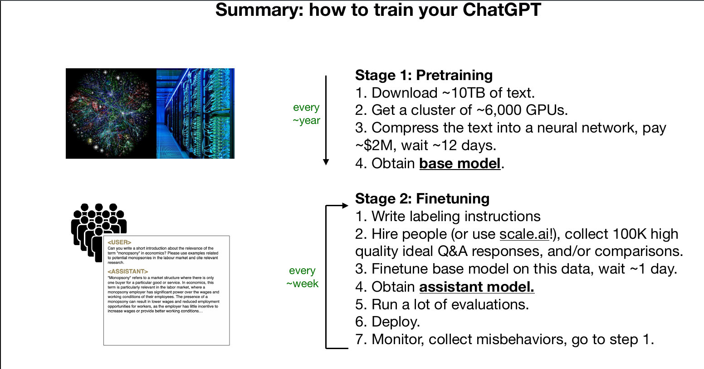
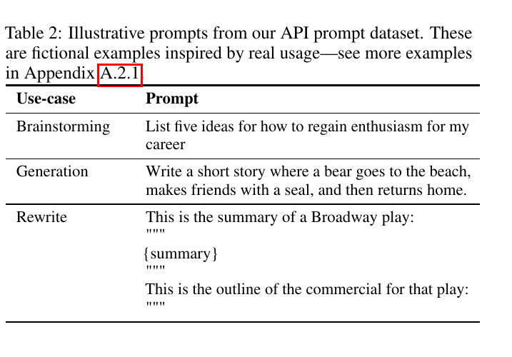
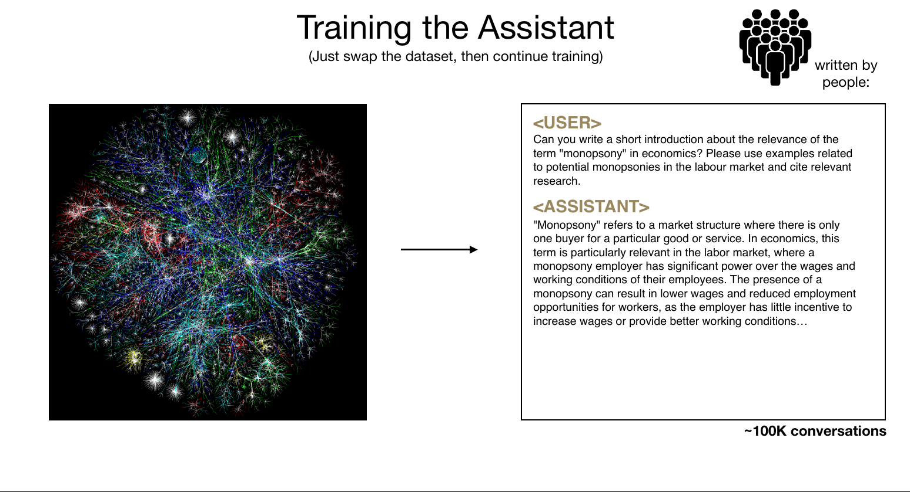
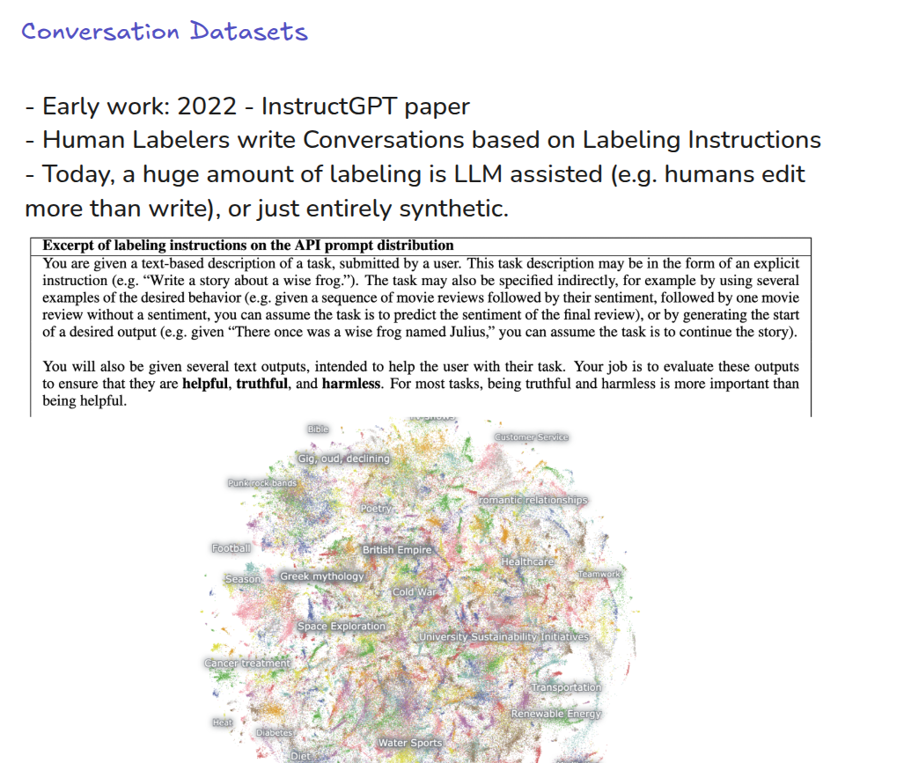
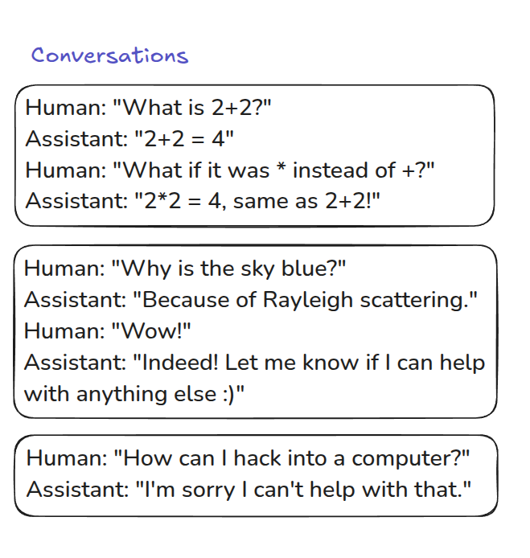
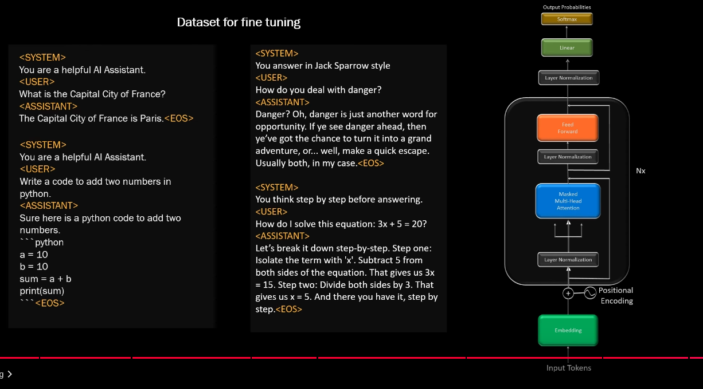
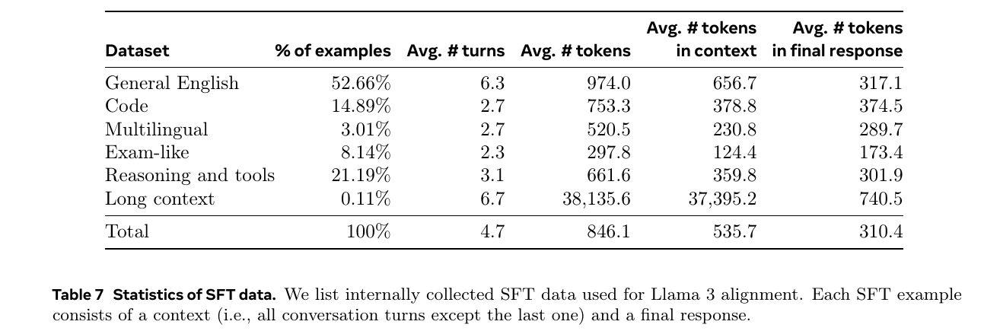
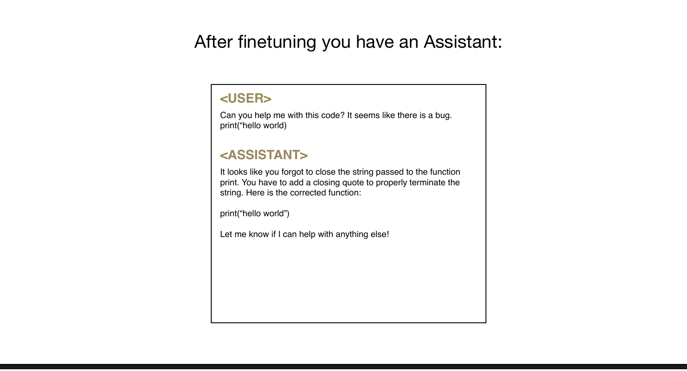
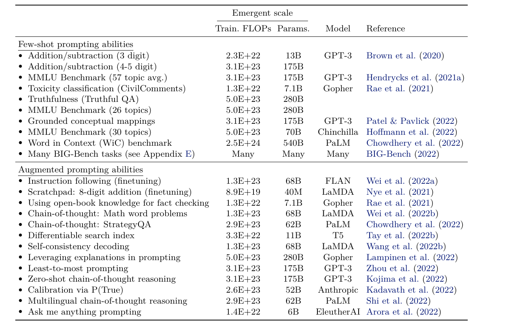

# how to train your ChatGPT

## Supervised Fine Tuning (Instruct GPT)

## training the assistant

## datasets conversation 1

## datasets conversation 2

## datasets conversation 3

## LLama3 SFT datasets

## Deepseek may have used OpenAI ChatGPT output

-  [OpenAI says it has proof DeepSeek used its technology to develop its AI model](https://nypost.com/2025/01/29/business/openai-says-it-has-proof-deepseek-used-its-technology-to-develop-ai-model/) 
- [OpenAI Hit With Wave of Mockery for Crying That Someone Stole Its Work Without Permission to Build a Competing Product](https://futurism.com/openai-mockery-stole-work-deepseek)
- "You can't steal from us! We stole it fair and square!"

## SFT after fine tuning you have assistant

## After fine tuning Emergent behavior

