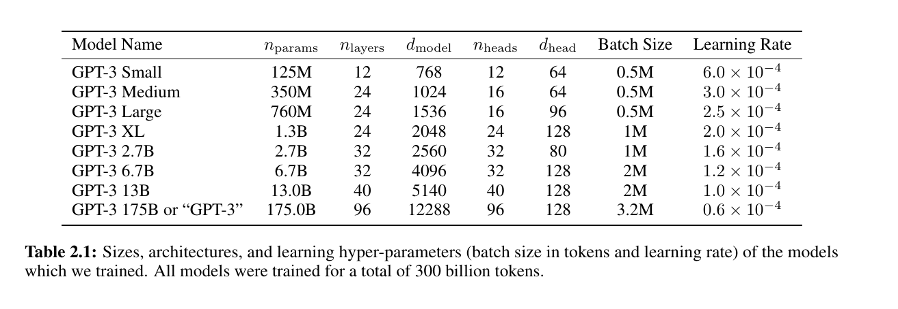
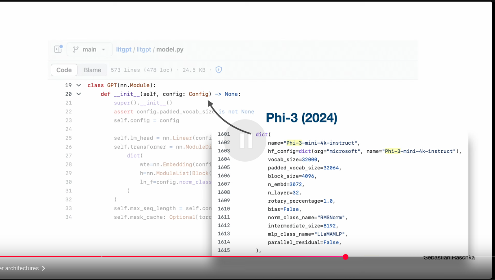

# Modern Architectures Derived From GPT

## LLM-visualization nano-gpt

## LLM-visualization gpt2

## LLM-visualization gpt3

## GPT2 sizes

## GPT3 sizes

## LLM-EvolutionTree

[source](https://github.com/Mooler0410/LLMsPracticalGuide)

## GPT Original architecture

## GPT2-architecture

## Modern Architectures Derived From GPT

## Modern Architectures Derived From GPT: Gemma2

## Modern Architectures Derived From GPT: Llama3

## Modern Architectures Derived From GPT: Mixtral

## Modern Architectures Derived From GPT: Phi3

## GPT2 vs Llama 1

## Llama 1 vs Llama 2

## Gemma 3 vs Qwen 3

## The Big LLM Architecture Comparison

- Read more in book author's [blog post 2025-07-19](https://magazine.sebastianraschka.com/p/the-big-llm-architecture-comparison)

