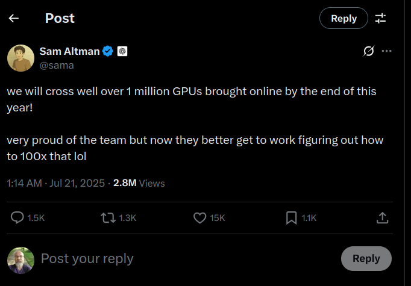

# Pretrain Datasets

## When training LLMs, Data quality matters

- diverse data
	+ harmful speech
	+ biases
- cleaning data
- deduplication (remove duplicates) 

## Datasets used to train GPT-3

 
## Datasets LLama 2

- Our training corpus includes a new mix of data from publicly available sources, which does not include data
from Meta’s products or services. 
- We made an effort to remove data from certain sites known to contain a high volume of personal information about private individuals. 
- We trained on **2 trillion tokens** of data as this
provides a good performance–cost trade-off, 
- up-sampling the most factual sources in an effort to increase knowledge and dampen hallucinations.

## Copyrighted Works Problem

- Meta staff torrented nearly 82TB of pirated books for AI training — court records reveal copyright violations
- OpenAI has been sued by novelists as far back as June 2023 for using their books to train its large language models, 
- with The New York Times following suit in December. - Nvidia has also been on the receiving end of a lawsuit filed by writers for using 196,640 books to train its NeMo model, which has since been taken down. 
- A former Nvidia employee blew the whistle on the company in August of last year, saying that it scraped more than 426 thousand hours of videos daily for use in AI training. 
- More recently, OpenAI is investigating if DeepSeek illegally obtained data from ChatGPT, which just shows how ironic things can get.
- [source](https://www.tomshardware.com/tech-industry/artificial-intelligence/meta-staff-torrented-nearly-82tb-of-pirated-books-for-ai-training-court-records-reveal-copyright-violations)

## Using Copyrighted Works in LLMs according to www.copyright.com

- LLMs use massive amounts of textual works—many of which are protected by copyright. 
- To do this, LLMs make copies of the works they rely on, which involves copyright in several ways, such as:

- Using copyright-protected material in the training datasets of LLMs without permission can result in the creation of unauthorized copies: copies generated during the training process and copies in the form of representations of the training data embedded within the LLM after training. This creates potential copyright liability.
- Outputs—the material generated by AI systems like LLMs—may create copyright liability if they are the same or too similar to one of the copyrighted works used as an input unless there is an appropriate copyright exception or limitation.
- [source](https://www.copyright.com/blog/heart-of-the-matter-copyright-ai-training-llms-executive-summary/)

## Datasets 

- Common crawl (Over 300 billion pages spanning 18 years) with variations
- [Star coder](https://huggingface.co/datasets/bigcode/starcoderdata) almost 800 GB Code examples
- [fine web](https://huggingface.co/datasets/HuggingFaceFW/fineweb) 18.5T tokens 
- Arxiv (Academic papers)

## Datasets Hugging face FineWeb

- The 🍷 FineWeb dataset consists of more than 18.5T tokens (originally 15T tokens) of cleaned and deduplicated english web data from CommonCrawl. 
- The data processing pipeline is optimized for LLM performance and ran on the 🏭 datatrove library, our large scale data processing library. 

- https://huggingface.co/datasets/HuggingFaceFW/fineweb

## Pre training different models

## Pre-training costs of different models

::: {style="font-size:14px"}



:::

## Sam-Altman-1million-GPU

